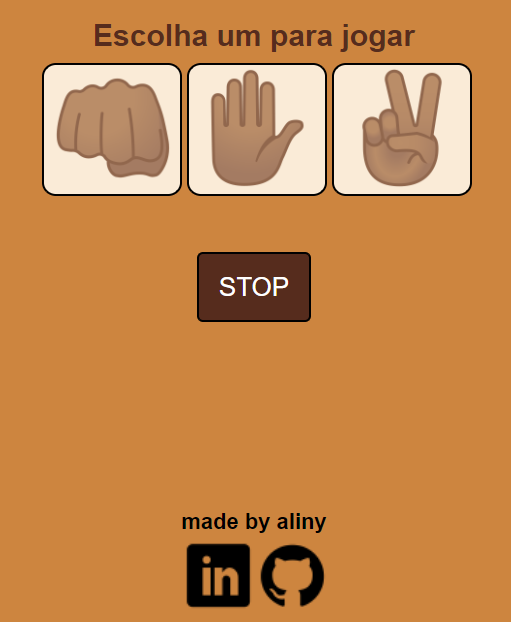

# Web rock-paper-scissors

<h3>A paper and scissors rock game made with javascript html css and Sass</h3>

  <h4>Technologies Used</h4>
  
  
  
  
  

   
  I hope you like it! :D

teste aqui -> https://gameweb-rock-paper-scissors.alisouzr.repl.co/
